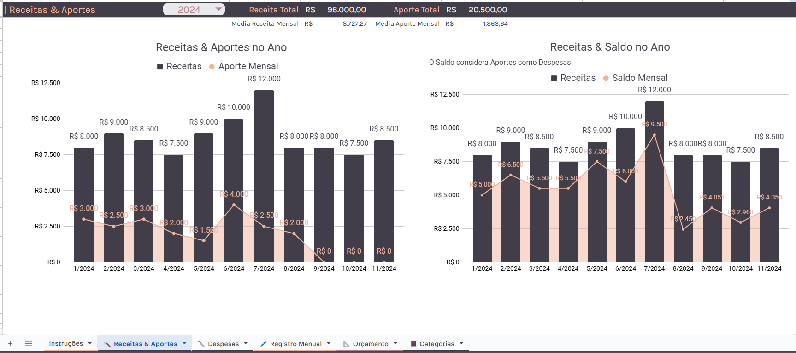
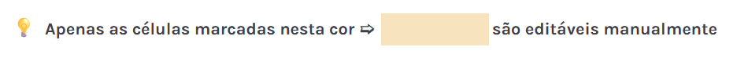
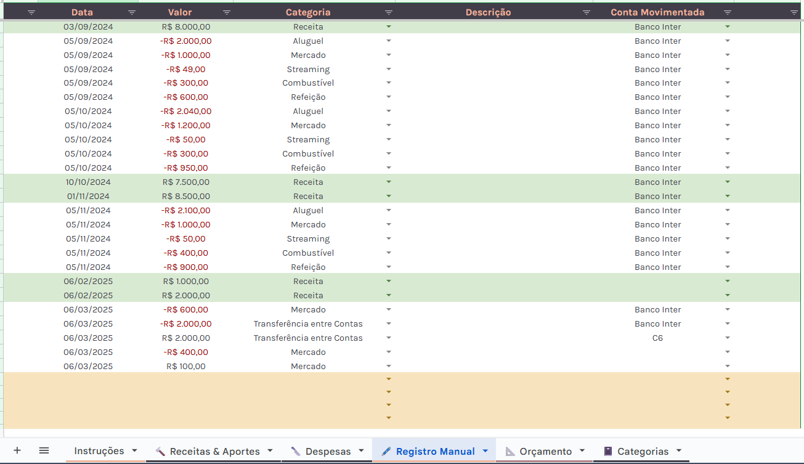
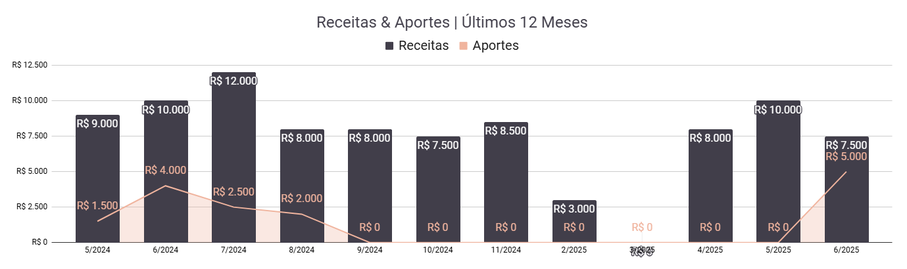
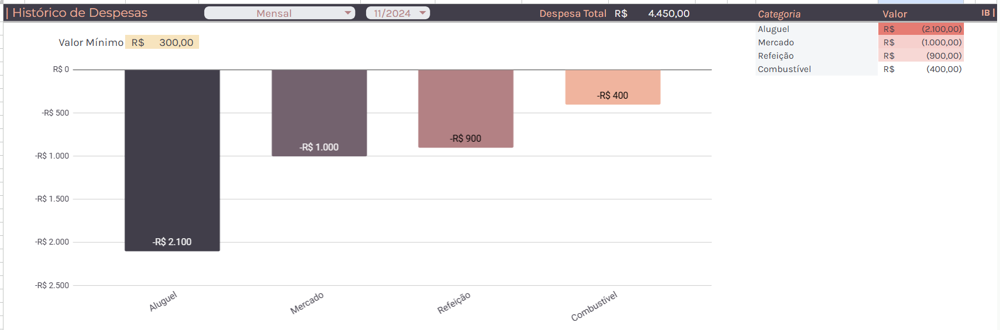
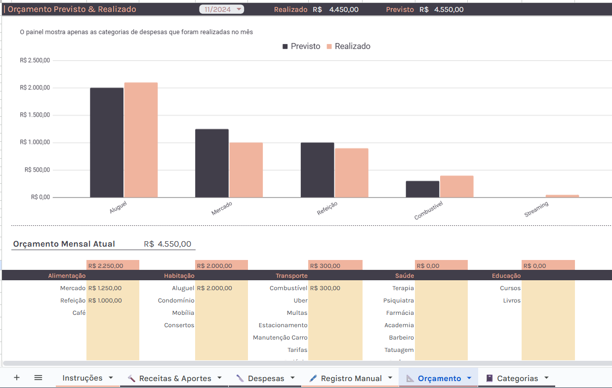

# 💵 Controle Financeiro
#### Se você é como eu e gosta de ter controle total das suas finanças, essa planilha foi feita para você. 
Desenvolvi ela ao longo dos anos para acompanhar de perto minhas Receitas, Despesas e Investimentos - e agora decidi compartilhar por aqui também.
Faça bom proveito e fique à vontade para sugerir melhorias!

### Clique para fazer uma cópia grátis ➯ [💵 Controle Financeiro](https://docs.google.com/spreadsheets/d/1TmSb_tLtEbiT6hjnSSyqmya5RT-hz97dbnttdzspeLw/copy?usp=drive_link)

- É uma planilha de Google Sheets. Fique à vontade para clicar no link acima e fazer uma cópia para usar no seu dia a dia, como apoio na organização das suas finanças e investimentos.

- Ao fazer uma cópia da planilha, se certifique de excluir os registros feitos de exemplo na aba 🖋️ Registro Manual, antes de começar a incluir os seus.

####

### Como começar: 														

#### ➯ 1. Defina as categorias 
- Defina as categorias que você utilizará para descrever as movimentações das suas contas na aba📓 Categorias.

- Na aba 📓 Categorias, você também pode registrar as suas contas correntes que serão movimentadas.

- Todas as categorias que você registrar nesta aba aparecerão como opção para seleção na aba 🖋️ Registro Manual.
#### ➯ 2. Defina um orçamento mensal (opcional)
- Defina um orçamento mensal a ser perseguido na aba 📐 Orçamento.

- Em 📐 Orçamento, defina um valor para cada categoria e acompanhe mensalmente se os seus gastos acompanharam este orçamento objetivo.

- Gastos extratordinários não devem ser registrados nesta aba, mas apenas os gastos fixos, que você tem previsibilidade. O objetivo aqui é acompanhar o seu orçamento com gastos fixos.
#### ➯ 3. Comece a lançar as movimentações
- Comece a lançar as movimentações na aba de 🖋️ Registro Manual.

- Regitre todas as suas Receitas e Despesas, bem como Aportes na aba de 🖋️ Registro Manual, seguindo as cetegorias definidas.	

#### ➯ 4. Acompanhe suas Receitas, Despesas e Investimentos
- Veja em gráficos mensais e anuais a relação das suas Receitas e seus Investimentos na aba 🔨 Receitas & Aportes, e das suas Despesas na aba 🔪 Despesas.
  				
####
Confira abaixo orientações mais detalhadas sobre a utilização de cada aba da planilha.

## Entenda como cada aba da planilha funciona
### Aba 🖋️ Registro Manual						
➯ A planilha funciona com uma lógica de Fluxo de Caixa. Entradas na conta devem ser registrados como valores positivos, e saídas como valores negativos.

➯ Todos os valores provenientes do seu trabalho devem ser registrados com a categoria Receita. Ex: salário, gratificações, vales, freelas...

➯ Todos os valores referentes a investimentos, sejam aportes ou resgates, devem ser registrados na categoria Aporte, utilizando valores positivos para os aportes e negativos para os resgates.

    Lembrando que:
    Aporte = valor enviado à corretora para investir
    Resgate = valor resgatado da corretora

➯ Utilize valores positivos e negativos para abater valores recebidos. Por exemplo, se um amigo está te pagando de volta por uma refeição que você pagou, regitre esse valor positivo (pois é uma entrada de caixa), com a categoria Refeição. Assim, vai ser reflertido corretamente o valor de Refeição que você gastou no mês, na aba de 🔪 Despesas.

### Aba 🔨 Receitas & Aportes						
➯ O painel superior esquerdo mostra a relação Receitas / Aportes no mês selecionado. O da direita mostra a relação Receitas / Saldo das suas finanças mensalmente (Receitas - Despesas dentro do mês).	

➯ Mais abaixo, outros painéis mostram a relação Receita / Aportes anualmente e também nos últimos 12 meses:

### Aba 🔪 Despesas						
➯ O painel superior mostra as suas despesas por categoria, em determinado mês ou ano:

➯ O painel inferior mostra o histórico de despesas por categoria, em determinado mês ou ano. Ou então, selecione "Todas as Categorias" para ver um histórico total de despesas e acompanhar o seu custo de vida:

						
### Aba 📐 Orçamento						
➯ Nesta aba você pode definir um orçamento mensal padrão a ser seguido e acompanhar mensalmente se você ficou em linha com essa projeção ou não.

						
#				
															
														
														
														
														
														